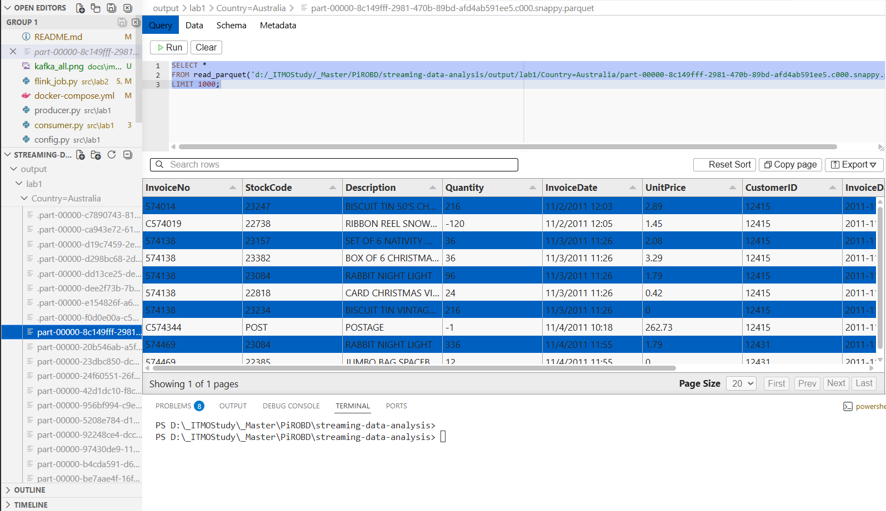
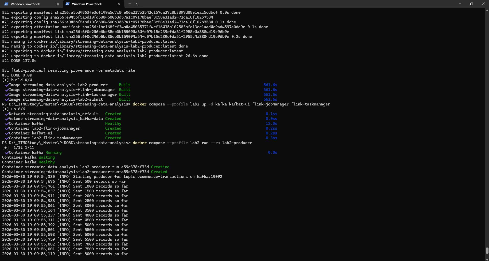
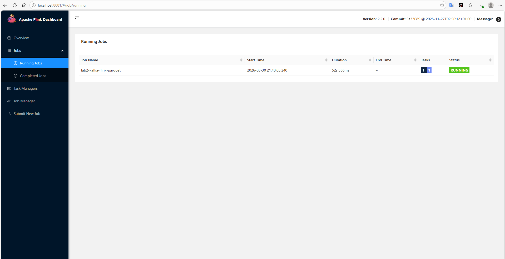
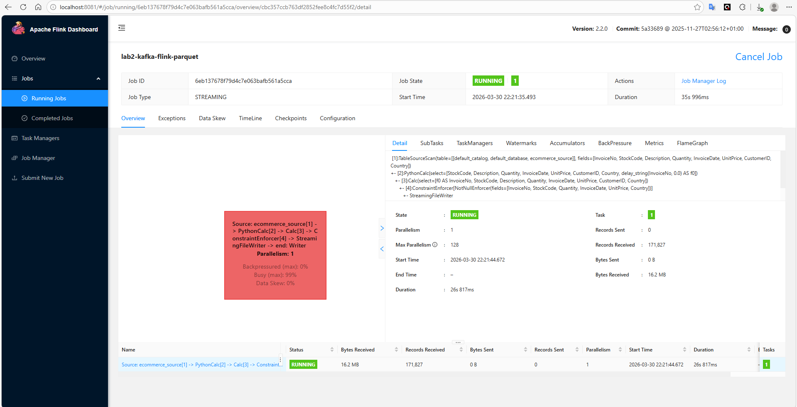
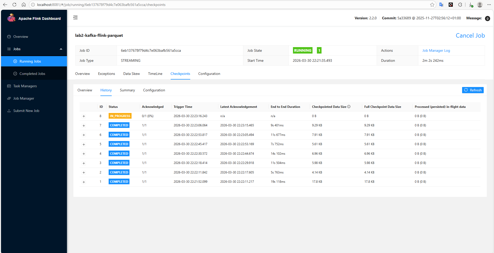
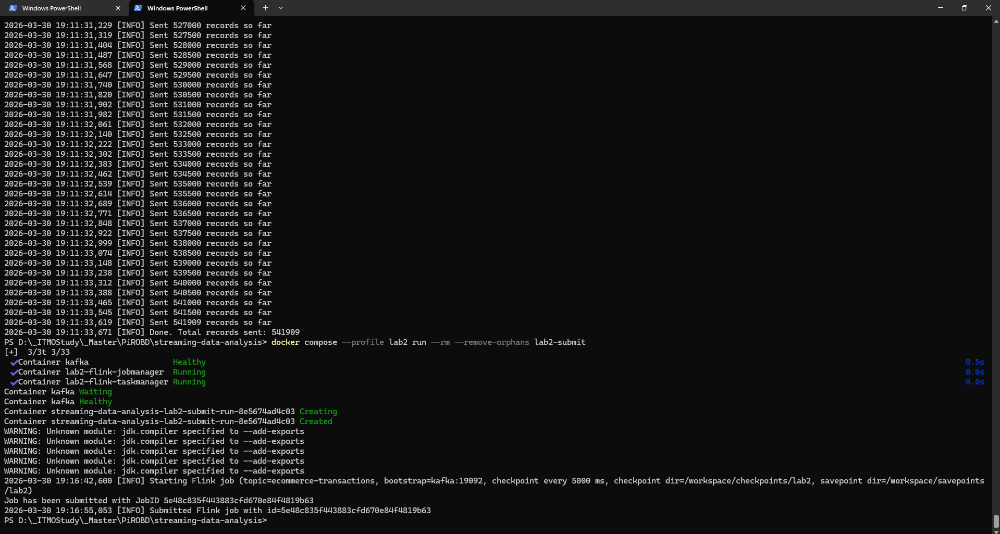

# Streaming Data Analysis

Лабораторные работы по потоковому анализу данных.

## Lab 1: Kafka + Spark Streaming

E-Commerce pipeline: CSV → Kafka Producer (Avro) → Spark Structured Streaming → Parquet.

### Обоснование выбора технологий

**Avro** (вместо Protobuf):
- Нативная интеграция с Kafka и Spark (`from_avro` из коробки)
- Self-describing формат, поддержка эволюции схемы
- Стандарт для data pipelines

**Parquet** (вместо ORC):
- Индустриальный стандарт для аналитики (pandas, DuckDB, Spark, BigQuery)
- Эффективное колоночное сжатие, predicate pushdown

### Запуск

#### Вариант 1: Kafka в Docker, сервисы локально

```bash
# Установить зависимости
poetry install

# Запустить Kafka (KRaft)
docker compose up -d

# Терминал 1: запустить consumer (Spark Streaming → Parquet)
poetry run python -m src.lab1.consumer

# Терминал 2: запустить producer (CSV → Kafka)
poetry run python -m src.lab1.producer
```

#### Вариант 2: всё в Docker

```bash
docker compose --profile lab1 up --build
```

#### Остановка

```bash
docker compose --profile lab1 down
docker network prune -f
```

### Параметры producer

```
--csv-path        путь к CSV (default: data/lab1/E-Commerce Data.csv)
--bootstrap-servers  адрес Kafka (default: localhost:9092)
--topic           имя топика (default: ecommerce-transactions)
--batch-size      размер чанка CSV (default: 500)
--delay           задержка между батчами в секундах (default: 0.1)
```

### Результат

Parquet-файлы записываются в `output/lab1/`, партиционированные по `Country`.

### Скриншоты




## Lab 2: Kafka + Flink

E-Commerce pipeline: CSV -> Kafka Producer (Avro) -> PyFlink Table API -> Parquet.

### Запуск

```bash
# 1) Поднять Kafka + Flink cluster
docker compose --profile lab2 up -d kafka kafbat-ui flink-jobmanager flink-taskmanager

# 2) Отправить данные в Kafka
docker compose --profile lab2 run --rm lab2-producer

# 3) Запустить Flink job (detached)
docker compose --profile lab2 run --rm --remove-orphans lab2-submit
```

Flink WebUI: [http://localhost:8081](http://localhost:8081)  
Kafka UI: [http://localhost:8080](http://localhost:8080)

### Остановка и запуск с savepoint

```bash
# job id
docker compose exec flink-jobmanager flink list -m flink-jobmanager:8081

# Остановить job с savepoint
docker compose exec flink-jobmanager flink stop `
  --savepointPath file:///workspace/savepoints/lab2 `
  -m flink-jobmanager:8081 <JOB_ID>

# Запустить снова с savepoint
docker compose exec flink-jobmanager flink run -d `
  -m flink-jobmanager:8081 `
  -s <SAVEPOINT_PATH> `
  -py /workspace/src/lab2/flink_job.py `
  -pyfs /workspace/src
```

### Верификация

```bash
poetry run python -m src.lab2.verify_parquet
```

### Тесты

```bash
poetry run pytest tests/ -v
```

### Скриншоты

Docker:


Скриншоты FlinkUI:




Создание Flink job:


Kafka (Avro messages):


